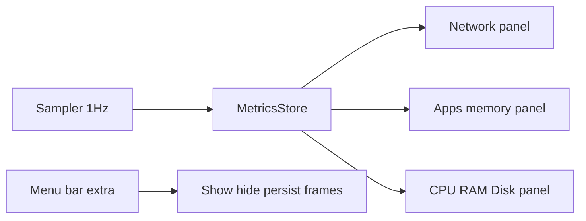

# metric-widget

Lightweight macOS desktop glass panels for live network, memory, CPU, RAM, and storage metrics.

Menu-bar app (no Dock icon). Toggle each panel, drag them on the desktop, optionally open at login.

## Run

```bash
swift build -c debug --product MetricsWidget
```

Then launch the signed app bundle at `build/MetricsWidget.app` (or open the Xcode project). Requires macOS 15+.

## Usage tile

Menu bar → **Usage** and **Settings…**. Enable Cursor and/or OpenAI (Anthropic is optional).

- **Cursor** reads the signed-in session from `state.vscdb` and calls Cursor’s unofficial current-period usage endpoint. Sign in to Cursor on this Mac; no extra key.
- **OpenAI / Anthropic** keys are generic Keychain passwords (`service` `com.frankmartinez.MetricsWidget`, accounts `openai.admin` and `anthropic.admin`). OpenAI needs an **Admin** key with `api.usage.read`. Anthropic needs `sk-ant-admin…`.

Equivalent CLI:

```bash
security add-generic-password -s com.frankmartinez.MetricsWidget -a openai.admin -w
```

Usage refreshes about every 10 minutes.

## Build plan

Native macOS widgets are Swift + SwiftUI (WidgetKit). That is not what this project is. WidgetKit is a snapshot renderer (~40–70 reloads/day). A network graph, CPU bar, and top-memory list need a tiny always-running app, the same pattern as Stats / iStat Menus.

This is a signed local macOS app (`MetricsWidget`) with a menu-bar extra and three borderless, draggable desktop panels. Visual language: system fonts, SF Symbols, semantic colors, and Tahoe glass (`NSGlassEffectView` on macOS 26, `NSVisualEffectView` fallback) so they sit next to the Clock widget without copying Apple’s private widget chrome.

Greenfield Xcode / SwiftPM macOS app (Swift 6, SwiftUI + a thin AppKit window layer). No App Sandbox: enumerating other processes’ RSS is blocked in the sandbox, and this is a local system monitor.



### App shell

- Xcode target: macOS app, menu-bar only (`LSUIElement` / `MenuBarExtra` so no Dock icon).
- Menu: toggle each panel, “Open at Login” via `SMAppService`, Quit.
- Three `NSPanel`s: borderless, transparent, movable-by-background, join all Spaces, level just above the desktop (visible over wallpaper, under normal windows unless we later add a “float on top” toggle). Persist origin per panel in `UserDefaults`.
- Glass: host SwiftUI in an AppKit visual-effect / glass content view. Content itself stays transparent; do not paint an opaque card.

### Lightweight sampler

One process, one timer (~1s), Mach/BSD APIs only — never `top`/`ps`/`ifconfig`. See [`MetricsWidget/Metrics/Sampler.swift`](MetricsWidget/Metrics/Sampler.swift) and friends.

- **CPU (gross):** `host_statistics` / `host_cpu_load_info` tick deltas → single percent.
- **RAM:** `host_statistics64` (`free` / `active` / `inactive` / `wired` / `compressed`) → used percent vs physical memory (`sysctl hw.memsize`).
- **Disk:** `statfs("/")` → used / free for a two-slice pie (Used / Free). Optional label with GB.
- **Network:** `getifaddrs` + `ifi_ibytes` / `ifi_obytes` deltas on the default-route interface (typically `en0`). Keep ~60 samples for up/down sparklines. Show interface name and IPv4. **Public IP:** one HTTPS lookup (e.g. `https://api.ipify.org`), cached 10–15 minutes, shown as “—” if offline. No per-second WAN polling.
- **Top memory apps:** `proc_listpids` + `proc_pidinfo(PROC_PIDTASKINFO)` for RSS; resolve names via `proc_name` / `NSRunningApplication`. Show top ~5–8. Keep `kernel_task` labeled so the snapshot matches Activity Monitor.

Pause the timer when all panels are hidden.

### Three panel UIs (Swift Charts + compact layout)

Fixed widget-like sizes (not free-resize), SF Pro, secondary labels at `.caption` / `.monospacedDigit()`.

1. **Network** — dual sparkline (up / down, distinct system-tint colors), current rates, interface (`en0`, etc.), LAN IP, WAN IP.
2. **App memory** — snapshot list: app name + RSS, plus a one-line total process memory if cheap. No per-process graphs.
3. **System** — storage pie (Used vs Free); CPU bar with percent overlay; RAM bar with percent overlay. Same bar treatment for both.

Swift Charts for pie + sparkline; custom `Canvas`/`ProgressView` style for the bars so the percent sits in/on the bar cleanly.

### Layout

- [`MetricsWidget.xcodeproj`](MetricsWidget.xcodeproj) + app target, Info.plist (`LSUIElement`), entitlements (no sandbox; outgoing network client for WAN IP).
- [`MetricsWidget/App/MetricsWidgetApp.swift`](MetricsWidget/App/MetricsWidgetApp.swift) — `MenuBarExtra`, panel lifecycle.
- [`MetricsWidget/App/GlassPanelWindow.swift`](MetricsWidget/App/GlassPanelWindow.swift) — AppKit panel + glass host.
- [`MetricsWidget/Metrics/Sampler.swift`](MetricsWidget/Metrics/Sampler.swift), [`CPU.swift`](MetricsWidget/Metrics/CPU.swift), [`Memory.swift`](MetricsWidget/Metrics/Memory.swift), [`Network.swift`](MetricsWidget/Metrics/Network.swift), [`Disk.swift`](MetricsWidget/Metrics/Disk.swift), [`Processes.swift`](MetricsWidget/Metrics/Processes.swift).
- [`NetworkPanelView.swift`](MetricsWidget/Views/NetworkPanelView.swift), [`AppMemoryPanelView.swift`](MetricsWidget/Views/AppMemoryPanelView.swift), [`SystemPanelView.swift`](MetricsWidget/Views/SystemPanelView.swift).

### Out of scope unless asked later

WidgetKit gallery widgets, per-core CPU, GPU, temperatures, click-through, multi-volume disks, floating-always-on-top, code signing for distribution outside this machine.
